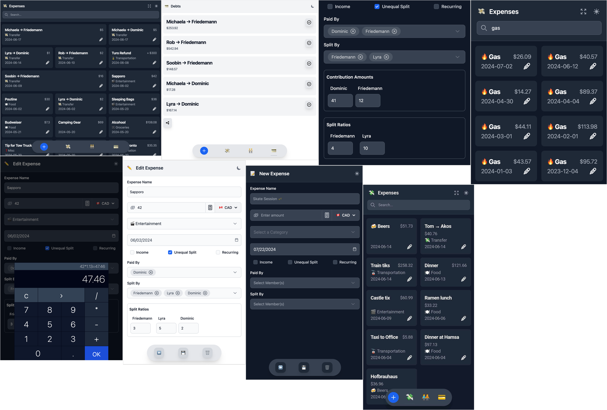

# 💸 xpnz

A sleek, modern,
ree & self-hosted group expense tracking app.

Try it [here!](https://www.xpnz.ca/)




## Self Host - Installation & Deployment

### 1. Install the Source Code and Project Requirements

Clone the repository and install the necessary dependencies:

```bash
git clone git@github.com:tomginsberg/xpnz.git
cd xpnz
npm install
```

### 2. Build the Project

Build the project using the following command:

```bash
npm run build
```

### 3. Set Up the Backend Service

Create a service file for the backend and configure it to start on system boot.

1. **Create the Service File:**

   Navigate to the systemd directory and create a new service file:

   ```bash
   cd /etc/systemd/system
   sudo vim xpnz.service
   ```

2. **Add the Following Contents to the Service File:**

   ```ini
   [Unit]
   Description=Run the xpnz backend service
   After=network.target

   [Service]
   WorkingDirectory=/path/to/xpnz
   ExecStart=npm run api
   User=root
   Group=root

   [Install]
   WantedBy=multi-user.target
   ```

   - Replace `/path/to/xpnz` with the actual path to your project directory.

3. **Reload the Systemd Manager Configuration:**

   ```bash
   sudo systemctl daemon-reload
   ```

4. **Start the Service:**

   ```bash
   sudo systemctl start xpnz.service
   ```

5. **Enable the Service to Start Automatically on Boot:**

   ```bash
   sudo systemctl enable xpnz.service
   ```

6. **Check the Status of the Service:**

   ```bash
   sudo systemctl status xpnz.service
   ```

### 4. Deploy the App with Caddy

Ensure Caddy is installed on your server. Follow the [official installation instructions](https://caddyserver.com/docs/install) if necessary.

#### Steps

1. **Create a Caddyfile:**

   Navigate to the directory where you want to store your Caddyfile:

   ```bash
   cd /etc/caddy
   sudo vim Caddyfile
   ```

   Add the following contents to the Caddyfile:

   ```text
   your_domain {
       root * /path/to/xpnz/dist
       file_server
       @notStatic {
           not file
       }
       rewrite @notStatic /index.html
       encode gzip
   }
   ```

   - Replace `your_domain` with your actual domain name.
   - Replace `/path/to/xpnz/dist` with the actual path to your project's `dist` directory.

2. **Set Up Systemd Service for Caddy:**

   Ensure the systemd service file for Caddy is set up to start on boot. Create or edit the file:

   ```bash
   sudo vim /etc/systemd/system/caddy.service
   ```

   Add the following content:

   ```ini
   [Unit]
   Description=Caddy web server
   After=network.target

   [Service]
   ExecStart=/usr/bin/caddy run --config /etc/caddy/Caddyfile --adapter caddyfile
   ExecReload=/usr/bin/caddy reload --config /etc/caddy/Caddyfile --adapter caddyfile
   Restart=on-failure

   [Install]
   WantedBy=multi-user.target
   ```

   - Ensure the `ExecStart` and `ExecReload` paths match the actual path where Caddy is installed.

3. **Enable and Start Caddy:**

   Reload the systemd manager configuration to recognize the new service:

   ```bash
   sudo systemctl daemon-reload
   ```

   Start the Caddy service:

   ```bash
   sudo systemctl start caddy
   ```

   Enable the service to start automatically on boot:

   ```bash
   sudo systemctl enable caddy
   ```

   Check the status of the service to verify it's running:

   ```bash
   sudo systemctl status caddy
   ```

4. **Check the Deployment:**

   Open your web browser and navigate to `your_domain`. Your website should now be live and served by Caddy.

### Troubleshooting

- If you encounter issues, you can check the logs for more details using:

  ```bash
  sudo journalctl -u caddy.service
  ```

- Ensure your DNS records are correctly set up to point to your server's IP address.

By following these steps, you should have your website deployed and running with Caddy.
